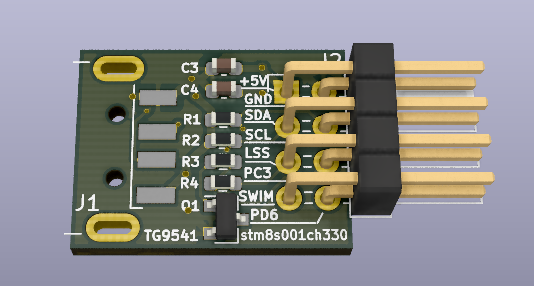
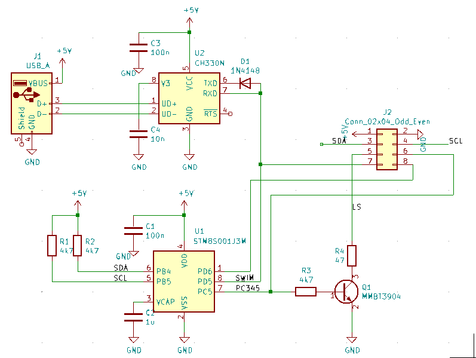
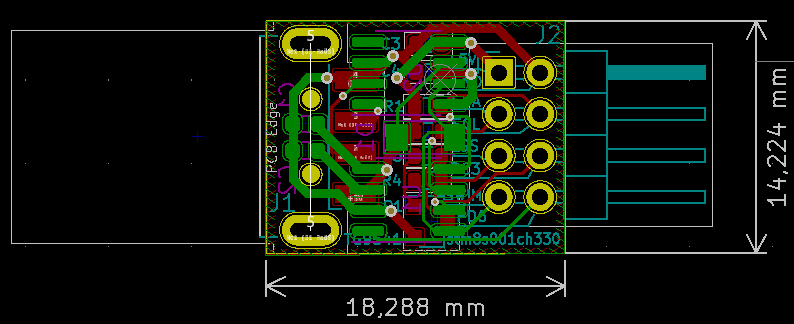

# USB Dongle STM8S001J3M3 w/ CH330N

<a href="https://oshpark.com/shared_projects/cjOgBYNw"></img></a>

Dongle STM8S001J3M3 with CH330N USB-UART - best with [STM8 eForth](https://github.com/TG9541/stm8ef).

The STM8S001J3M3 UART works in "half-duplex" mode (pin8 PD5/UART_TX) and the CH330N USB-UART is in a matching wired-or configuration (D1). The internal pull-up of PD5 should be active (this is the default for the STM8 eForth [STM8S001J3](https://github.com/TG9541/stm8ef/tree/master/STM8S001J3) base image).

The SMD USB-A connector is "China standard" (e.g. [here](https://www.aliexpress.com/item/32900067411.html), refer to the BOM is in the docs folder).

J2 provides the following signals:

Pin|Description
-|-
1|+5V from USB (relies on the port's short-circuit protection)
2|GND
3|I2C SDA w/ 4k7 pull-up (pin4, i.e. PB4)
4|I2C SCL w/ 4k7 pull-up (pin5, i.e. PA3, PB5)
5|Low Side switch (LS NPN) w/ 47R, e.g. to drive an IR LED @ 100mA)
6|PC3 (same as LS NPN base, pin7, i.e. PC3, PC4, PC5)
7|SWIM (pin8, i.e. PC6, PD1, PD3 and PD5)  
8|PD6 (pin1, i.e. PA1, PD6)

Example use-cases:

* Pins 1, 2, 3 and 4 can be used for testing I2C modules w/ 5V supply (e.g. [STM8 eForth I2C Master](https://gist.github.com/TG9541/5c3405320794d91ef8129734a4bfc880#gistcomment-3565181))
* Pins 1 and 5 can be used for a 100mA IR LED (e.g. [IR Remote Control](https://gist.github.com/TG9541/40b811c3a611eb02ba9e3693f99222ac))
* Pins 1, 2 and 8 can be used for connecting an IR receiver
* Pins 1, 2 and 3 can control a [WS2812 LED strip](https://gist.github.com/TG9541/1761fa86b425a0c909b7bd1cc8017c2b)
* [Learn programming Forth ...](https://github.com/TG9541/stm8ef/wiki/STM8-eForth-Programming)

The PCB shouldn't be too difficult to populate by and hand. I recommend starting with D1, then U1, U2, C1 and C2. On the front side populate Q1 and passive components first, then J1 and finally J2. 

In case the J1 breakouts aren't needed, the following subset of components is suffucient: U1, U2, D1, C1, C2, C3, C4 and J1.
